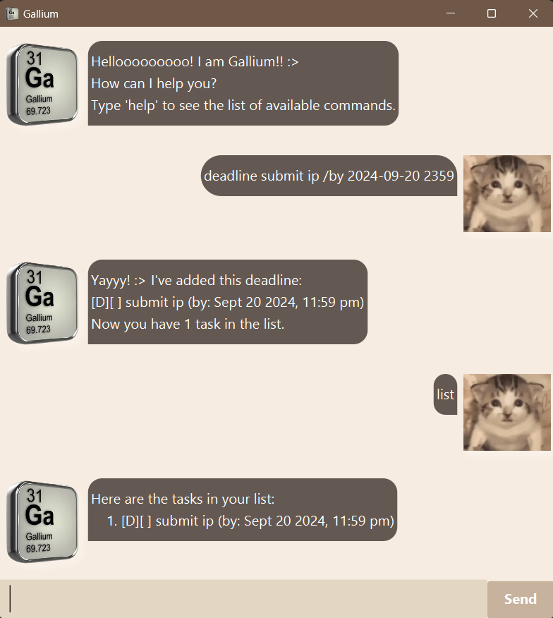

# Gallium User Guide

Gallium is your **todos, deadlines and events manager chatbot**, optimized for use via a **Command Line Interface (CLI)** while still having the benefits of a **Graphical User Interface (GUI)**. You can add todos, deadlines, and events into a tasklist, and mark them as completed, edit, delete them, and search for tasks.

- [Quick Start](#quick-start)
- [Commands](#commands)
  - [Viewing the Task List: `list`](#viewing-the-task-list-list)
  - [Adding Todo Tasks: `todo`](#adding-todo-tasks-todo)
  - [Adding Deadline Tasks: `deadline`](#adding-deadline-tasks-deadline)
  - [Adding Event Tasks: `event`](#adding-event-tasks-event)
  - [Marking Tasks as Completed: `mark`](#marking-tasks-as-completed-mark)
  - [Marking Tasks as Not Completed Yet: `unmark`](#marking-tasks-as-not-completed-yet-unmark)
  - [Deleting Tasks: `delete`](#deleting-tasks-delete)
  - [Finding Tasks: `find`](#finding-tasks-find)
  - [Filtering Tasks by Date: `date`](#filtering-tasks-by-date-date)
  - [Editing Tasks: `edit`](#editing-tasks-edit)
  - [Exiting: `bye`](#exiting-bye)
- [Storage](#storage)
- [Command Summary](#command-summary)

# Quick Start

1. Ensure you have Java `17` or above installed in your Computer.

2. Download the latest `.jar` file from here.

3. Copy the file to the folder you want to use as the home folder for Gallium.

4. Open a command terminal, `cd` into the folder you put the jar file in, and use the `java -jar gallium.jar` command to run the application.
   A GUI similar to the below should appear in a few seconds.



5. Refer to the Features below for details of each command.

# Commands

## Viewing the Task List: `list`

View the entire task list. The task list will be shown as follows:

- Task Type (`T` is a Todo, `D` is a Deadline and `E` is an Event)
- Status (`[X]` for completed, `[ ]` for incomplete)
- Description of Task
- Date and Time (for Deadline and Event) in `MMM DD YYYY, HH:MM aa` format

Example List:

```
1. [T][X] do ip
2. [D][ ] submit ip (by: Sep 20 2024, 23:59 PM)
3. [E][ ] cry over ip (from: Sep 20 2024, 06:58 PM to: Sep 20 2024, 06:59 PM)
```

Format: `list`

## Adding Todo Tasks: `todo`

Adds a todo task to the task list.

- No start or end date.

Format: `todo <Description>`

Example: `todo do ip`

## Adding Deadline Tasks: `deadline`

Adds a deadline task to the task list.

- Has one `/by` date.
- `/by` date must be specified in `YYYY-MM-DD HHMM` format.

Format: `deadline <Description> /by <date>`

Example: `deadline submit ip /by 2024-09-20 2359`

## Adding Event Tasks: `event`

Adds an event task to the task list.

- Has a `/from` date and `/to` date.
- `/from` date and `/to` date must be specified in `YYYY-MM-DD HHMM` format.

Format: `event <Description> /from <date> /to <date>`

Example: `event lecture /from 2024-09-20 2359 /to 2024-09-21 0159`

## Marking Tasks as Completed: `mark`

Marks a task at index `i` of task list as completed.

- index `i` starts at 1.

Format: `mark <Index>`

Example: `mark 100`

## Marking Tasks as Not Completed Yet: `unmark`

Marks a task at index `i` of task list as not completed.

- index `i` starts at 1.

Format: `unmark <Index>`

Example: `unmark 100`

## Deleting Tasks: `delete`

Deletes task at index `i` of task list.

- index `i` starts at 1.
- Description of the deleted task will be shown.

Format: `delete <Index>`

Example: `delete 100`

## Finding tasks: `find`

Finds tasks which descriptions contains the keyword being input.

- Tasks with description containing the keyword will be shown in a list.

Format: `find <Keyword>`

Example: `find submit`

## Filtering Tasks by Date: `date`

Finds tasks which date matches the date being input.

- Tasks with dates matching the date being input will be shown in a list.

Format: `date <date>`

Example: `date 2024-09-20`

## Editing Tasks: `edit`

Edits task details at index `i` of task list.

- index `i` starts at 1.

### User Input Flow

**Initial Command:**

Format: `edit <Index>`

Example: `edit 1`

**Prompt for Editing:**

- Todo tasks: User will be prompted to enter a new description.

- Deadline tasks: The user will be prompted to enter the index represented by the field followed by the new details of the field.

1. description
2. date

- Event tasks: The user will be prompted to enter the index represented by the field followed by the new details of the field.

1. description
2. from date
3. to date

Format: `<Index>. <New details>`

Example: `2. 2024-09-20 2359`

## Exiting: `bye`

Exits the program.

Format: `bye`

# Storage

Gallium saves all your tasks automatically to a local file named `gallium.txt` stored in `[Gallium JAR file location]/data/`. There is no need to save manually.

# Command Summary

| Command    | Usage                                         | Description                                                      |
| ---------- | --------------------------------------------- | ---------------------------------------------------------------- |
| `list`     | `list`                                        | View the entire task list.                                       |
| `todo`     | `todo <Description>`                          | Adds a todo task to the task list.                               |
| `deadline` | `deadline <Description> /by <date>`           | Adds a deadline task to the task list.                           |
| `event`    | `event <Description> /from <date> /to <date>` | Adds an event task to the task list.                             |
| `mark`     | `mark <Index>`                                | Marks a task at index `i` of task list as completed.             |
| `unmark`   | `unmark <Index>`                              | Marks a task at index `i` of task list as not completed.         |
| `delete`   | `delete <Index>`                              | Deletes task at index `i` of task list.                          |
| `find`     | `find <keyword>`                              | Finds tasks which descriptions contains the keyword being input. |
| `edit`     | `edit <Index>`                                | Edits task details at index `i` of task list.                    |
| `date`     | `date <date>`                                 | Finds tasks which date matches the date being input.             |
| `bye`      | `bye`                                         | Exits the program.                                               |
